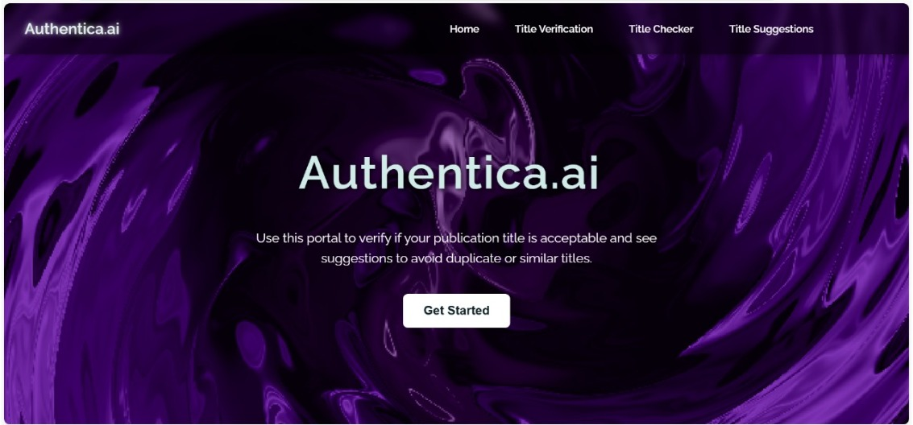
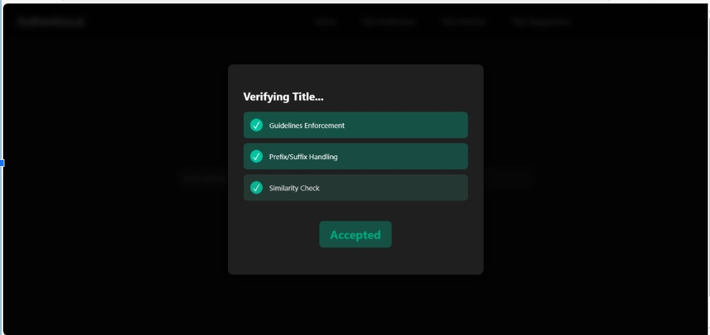
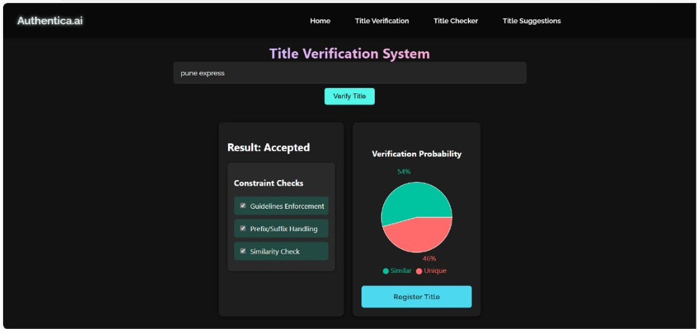
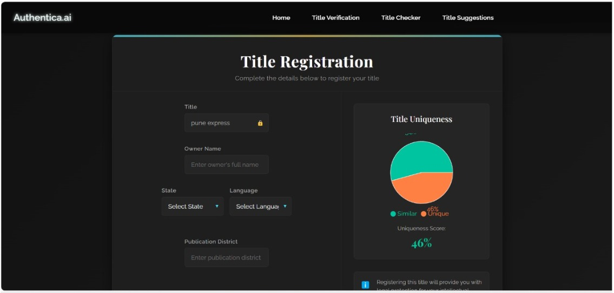
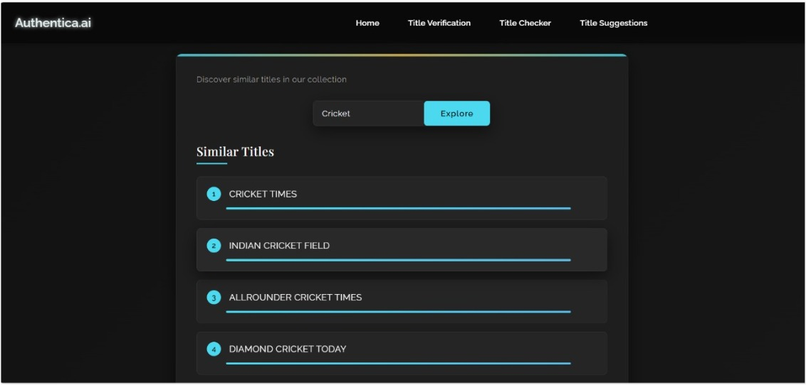
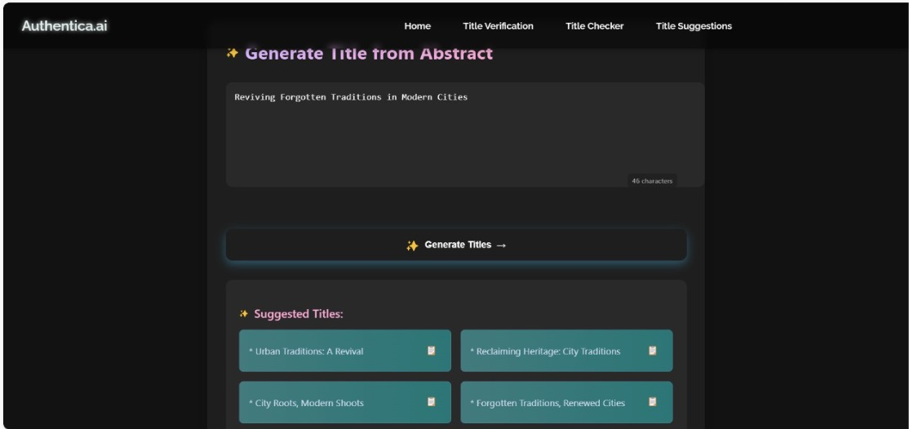

# 🧠 Title Verification System

### Problem ID: 1782

## 📌 Problem Statement
The current process of verifying and approving titles for newspapers and periodicals in India, overseen by the Press Registrar General of India (PRGI), is manual, time-consuming, and lacks linguistic intelligence. With the rising number of applications and multilingual diversity, it becomes crucial to ensure that new titles are unique, non-deceptive, and contextually appropriate across languages.

## 🎯 Objective
To develop an AI-powered multilingual **Title Verification System** that:
- Automatically verifies proposed publication titles.
- View  existing titles to avoid duplication or confusion.
- Suggest Titles from the Abstract. 
- Supports multiple Indian languages.
- Provides real-time feedback to the applicant during the registration process.

## 🛠️ Key Features
- ✅ **AI/ML-Based Similarity Detection**: Checks for phonetic, semantic, and string similarity.
- 🌐 **Multilingual Support**: Handles title entries in Hindi, English, Marathi and Roman Script.
- 🧠 **Smart Suggestions**: Recommends titles on the context of abstract.
- 📊 **Dashboard for Users**: Allows users to review the reason title  rejected  based on similarity score.
- 🔄 **Real-Time Feedback**: Displays instant title conflict warnings to users at registration.

## 💡 Technologies Used
- **Frontend**: React.js, Tailwind CSS
- **Backend**: Python (Flask / FastAPI)
- **AI/ML**: NLP with transformers (BERT, FastText), phonetic matching (Soundex, Metaphone)
- **Database**: MongoDB 
- **Others**: Firebase (Auth), Google Gemini API, Indic NLP Library

## 🧩 System Architecture
1. **User Interface** for entering and submitting title proposals.
2. **Preprocessing & Normalization** of text using NLP.
3. **Similarity Engine**:
   - Lexical & semantic similarity
   - Transliteration matching
   - Multilingual comparison
4. **Decision Engine** for conflict resolution and suggestions.
5. **Admin Panel** for PRGI officers to manage titles.

## 🎥 Demo Preview

### 🔹 Landing Page 

### 🔹 Vierifying title

### 🔹 Result of User input title

### 🔹 Registeration of Title

### 🔹 View Similar Titles

### 🔹 Suggest Titles

# Step 1: Install Backend Dependencies
cd Backend
pip install -r requirements.txt

# Step 2: Preprocess and Index Titles
python run_preprocessing_and_index.py

# Step 3: Run Backend Server
python app.py

# Step 4: Start Frontend
cd ../frontend_final
npm install
npm start

